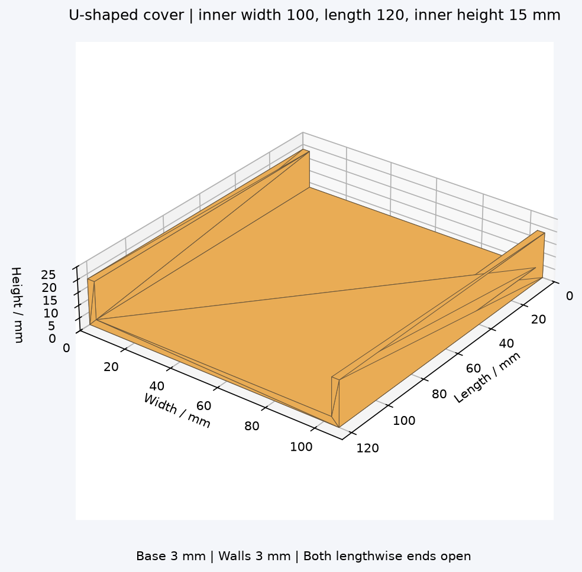
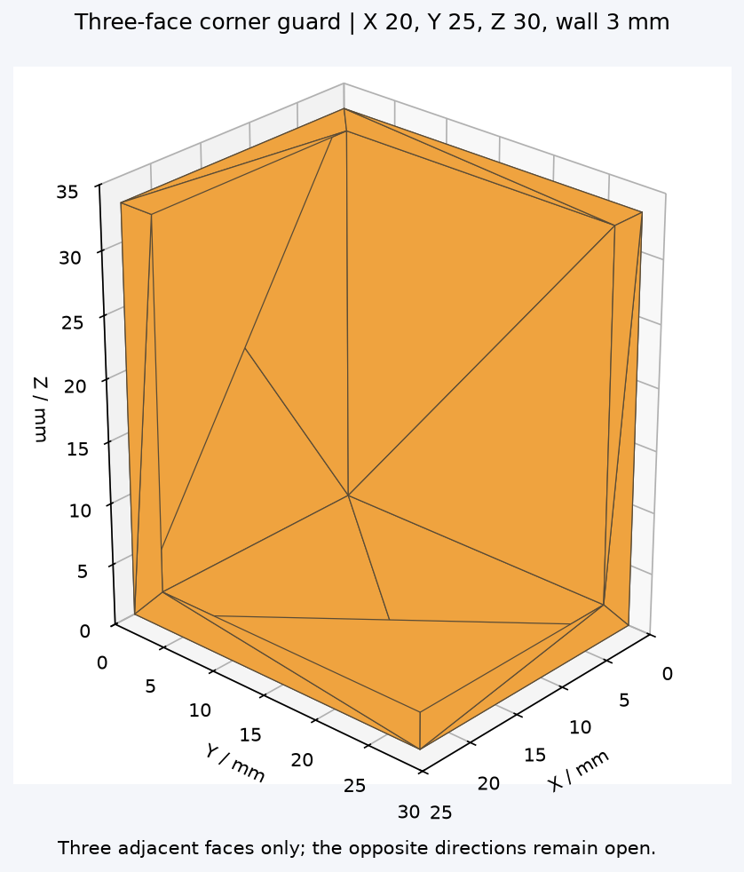
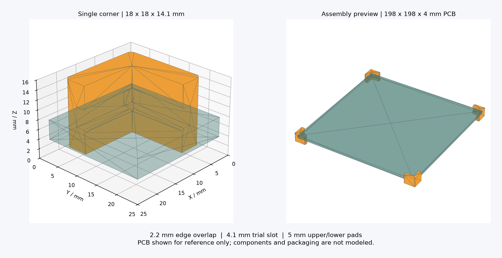

# 护角与 U 形盖板生成器

**v1.2.0 新增 U 形盖板**，程序现有 PCB 夹槽护角、立方体 / 长方体三面护角、U 形盖板三种类型。

## U 形盖板：两端开口



窗口中选择 **U 形盖板**，输入以下参数（单位 mm）：

| 参数 | 命令行参数 | 默认值 | 定义 |
| --- | --- | ---: | --- |
| 内宽 W | `--width` | 100 | 两条侧壁内表面之间的净距离 |
| 长度 L | `--length` | 120 | 沿侧壁方向，两开口之间的距离 |
| 侧壁内高 H | `--height` | 15 | 从平板内表面到侧壁顶部 |
| 平板厚度 T | `--base` | 3 | 中间平板的厚度 |
| 侧壁厚度 S | `--wall` | 3 | 两条侧壁的共同厚度 |

外形尺寸为 **L × (W+2S) × (H+T)**。结构仅含一块平板及两条相对侧壁，长度方向两端敞开；内宽与内高不自动增加装配间隙。当前两条侧壁等高、等厚，不含孔、卡扣或端墙。

```powershell
python program/corner_guard.py --type ucover --width 100 --length 120 --height 15 --base 3 --wall 3 --out ./ucover-model
```

输出 `cover_single.stl`、`cover_parametric.scad`、离线 `preview.html`、参数记录及打印说明。不自动生成四件或八件护角排版。

技能调用示例：

> 用 $pcb-corner-guard 生成 U 形盖板：内宽 100 mm、长度 120 mm、侧壁内高 15 mm、平板厚度 3 mm、侧壁厚度 3 mm。

平板外表面朝下打印。确认外形尺寸适合打印平台；套住物体时需在给定内宽、内高中考虑装配间隙。

[查看 U 形盖板示例文件](examples/ucover)

**v1.1.0 新增立方体 / 长方体三面护角。** 在窗口中选择结构类型：PCB 模式保留夹槽和上下垫高；三面模式围住一个顶点的三个相邻面，另外三个方向敞开。

[下载最新版程序与技能包](https://github.com/longxiaoxiaoqi/3D-Corner-guard-generator/releases/latest)

## 三面护角：立方体与长方体



选择窗口的 **立方体 / 长方体三面护角** 选项卡，设置：

| 参数 | 默认值（mm） | 含义 |
| --- | ---: | --- |
| X 方向包覆长度 | 20 | 从物体顶点沿 X 棱延伸的长度 |
| Y 方向包覆长度 | 20 | 从物体顶点沿 Y 棱延伸的长度 |
| Z 方向包覆长度 | 20 | 从物体顶点沿 Z 棱延伸的长度 |
| 壁厚 | 3 | 三个面的共同厚度 |

三条包覆长度可相同或不同，均不包含壁厚，**不是物体的完整长宽高**。外形尺寸为 `(X+壁厚) × (Y+壁厚) × (Z+壁厚)`。仅生成三个相邻面，不生成对面的盖子，也不使用 PCB 的夹槽、内嵌或上下垫高参数。

```powershell
python program/corner_guard.py --type cuboid --x 20 --y 25 --z 30 --wall 3 --out ./cuboid-model
```

三面模式输出 `corner_single.stl`、`corner_mirrored.stl` 和 `corner_eight.stl`，以及参数化源文件、离线预览、参数记录和打印说明。八件排版包含四个原件、四个镜像件；当 X/Y/Z 不同时，配合旋转可让八个角的包覆长度保持对应物体轴向。

模型底面朝下打印。每条棱两端的包覆长度之和不能超过物体对应尺寸，否则护角会重叠。该结构没有主动锁扣，需要包装定位。原 PCB 的 3 mm 接触限制不自动用于新物体。

技能调用示例（名称保持兼容）：

> 用 $pcb-corner-guard 生成长方体三面护角：X 包覆 20 mm，Y 包覆 25 mm，Z 包覆 30 mm，壁厚 3 mm。

[下载或查看三面护角示例](examples/cuboid)

## PCB 夹槽护角

输入内嵌深度、夹槽净高、上下垫高和护角边长，生成可用于 3D 打印的 **L 形加厚护角**。四个护角分别套住 PCB 四角，使板的上下两面与外部包装保持距离。

本仓库同时提供 **本地窗口程序** 和 **Codex Skill**，两种方式使用同一套生成逻辑。不需要安装 OpenSCAD 即可导出 STL。



图中的 PCB 仅作装配示意；STL 只包含护角，不包含板、芯片或包装。

## 快速开始：本地程序

当前已在 **Windows / Python 3.14** 验证。程序包不是独立 EXE。

1. 克隆本仓库，或点击 GitHub 的 **Code → Download ZIP**，解压到本地。
2. 安装 Python 3.14，启用 PATH，并保留 tkinter/Tcl-Tk 组件。
3. 打开 `program` 文件夹，双击 **安装依赖.cmd**。首次安装需要联网。
4. 双击 **启动生成器.cmd**，输入尺寸和输出目录，再点击 **生成护角模型**。
5. 完成后点击 **打开 3D 预览**，可拖动旋转、滚轮缩放。

依赖安装完毕后，模型生成与 HTML 预览均可离线使用。窗口程序每次会新建带时间的文件夹，保留之前的模型。

如果双击不能启动，可在仓库根目录运行以下命令查看错误：

```powershell
python -m pip install -r program/requirements.txt
python program/corner_guard.py --gui
```

## 参数定义

所有数值单位均为 **mm**。

| 参数 | 默认值 | 含义 |
| --- | ---: | --- |
| 内嵌深度 | 2.2 | 护角覆盖 PCB 板面的宽度，沿相邻板边的垂直方向测量 |
| 夹槽高度 | 4.1 | 实际建模净高；程序不会额外增加装配间隙 |
| 上垫高 | 5 | 从夹槽上表面到护角顶部的厚度 |
| 下垫高 | 5 | 从夹槽下表面到护角底部的厚度 |
| 护角边长 | 15 | 沿 PCB 每条边延伸的长度，不包含外侧壁厚 |
| 外侧壁厚 | 3 | PCB 外侧的护角壁厚 |

上下垫高可以分别设置。例如默认参数生成的单件外形为 **18 × 18 × 14.1 mm**：

- 外形长宽 = 护角边长 + 外侧壁厚。
- 总高 = 下垫高 + 夹槽高度 + 上垫高。
- 四个角使用同一个零件，安装时分别旋转到对应方向。
- PCB 长宽不影响单件护角的形状，因此无需输入板长宽。

程序支持 0.2～1000 mm 的有限数值，且护角边长必须大于内嵌深度。此范围是输入校验范围，并非所有组合都适合实际打印。

## 输出文件

| 文件 | 用途 |
| --- | --- |
| `corner_single.stl` | 单个护角，建议先打印试配 |
| `corner_four.stl` | PCB 模式四个护角的打印排版 |
| `corner_parametric.scad` | 可在 OpenSCAD 中修改的参数化源文件 |
| `preview.html` | 可离线打开的旋转三维预览 |
| `parameters.json` | 输入参数、外形尺寸与模型检查记录 |
| `打印说明.txt` | 当前参数对应的打印与装配说明 |

STL 本身不声明单位，导入切片软件时请选 **毫米、100% 比例**。请勿通过整体缩放来调整夹槽松紧，否则其他尺寸也会改变。

[默认参数示例文件](examples/default)可直接查看或下载。

## 命令行使用

在仓库根目录运行：

```powershell
python program/corner_guard.py --overlap 2.2 --slot 4.1 --top 5 --bottom 5 --arm 15 --wall 3 --out ./my-model
```

上下使用不同垫高的例子：

```powershell
python program/corner_guard.py --overlap 2 --slot 3.8 --top 8 --bottom 2 --arm 22 --out ./my-model-asymmetric
```

命令行会更新指定目录中的同名输出文件；如需保留旧版，请指定新的目录。

## 安装 Codex Skill

将仓库中的 `skills/pcb-corner-guard` 文件夹复制到个人技能目录：

- 默认：`~/.codex/skills/pcb-corner-guard`
- 如果设置了 `CODEX_HOME`：`$CODEX_HOME/skills/pcb-corner-guard`

Windows PowerShell 示例（在仓库根目录执行）：

```powershell
$skillBase = if ($env:CODEX_HOME) { Join-Path $env:CODEX_HOME 'skills' } else { Join-Path $env:USERPROFILE '.codex/skills' }
New-Item -ItemType Directory -Force -Path $skillBase | Out-Null
Copy-Item -Recurse -Path ./skills/pcb-corner-guard -Destination $skillBase
```

如已有同名技能，请先检查并备份旧目录，避免混合不同版本。技能运行环境也需要安装 `program/requirements.txt` 中的依赖。

技能可用后，可这样提出请求：

> 用 $pcb-corner-guard 生成护角：内嵌 2.2 mm，夹槽 4.1 mm，上下各垫高 5 mm，边长 15 mm。

也可分别指定上下高度：

> 用 $pcb-corner-guard 生成护角：内嵌 2 mm，夹槽 3.8 mm，上垫高 8 mm，下垫高 2 mm，边长 22 mm。

技能会生成模型并提供文件链接。详细参数规则见 [SKILL.md](skills/pcb-corner-guard/SKILL.md)。

## 结构与打印注意事项

此模型来自一块 **198 × 198 × 4 mm** PCB 的运输护角需求，该板允许接触的边缘区域为 3 mm。更换 PCB 时需要重新确认可接触范围，尤其是沿两条边的整个护角长度范围。

- 四角的上下表面及板边可接触，芯片区域须避空。
- 夹槽入口带导向倒角，部分外侧棱边带平倒角。
- 默认放置方向为下支撑面朝下。夹槽上沿存在局部悬空，需在切片软件中检查并按设备能力设置支撑。
- 先打印单个护角，用废板检查松紧，清除槽内毛刺后再装实际 PCB。
- 本结构为开槽护套，没有主动锁扣。运输包装需限制护角向外滑脱；上下保护板仅与护角接触，并考虑包装和 PCB 受压变形后的间隙。

程序检查数字模型的封闭性、法线、组件数量及外形尺寸，并回读导出的 STL。**这些检查不代表实物打印、承载或运输测试已通过。**

## 仓库结构与验证

```text
program/                    三种类型的参数窗口与命令行程序
skills/pcb-corner-guard/     可复制安装的完整技能
examples/default/           默认参数示例和装配图
examples/cuboid/            三面护角示例、八件排版和预览图
examples/ucover/            两端开口 U 形盖板示例和预览图
tests/test_generator.py     几何、非法输入及窗口生成测试
```

安装运行依赖后，在 Windows 桌面环境运行：

```powershell
python tests/test_generator.py
```

测试覆盖四组 PCB 尺寸、三组三面护角尺寸、三组 U 形盖板尺寸；包括独立截面与体积、三面护角三向开口、盖板两端开口与厚度、镜像排版、非法参数，以及三个类型的窗口生成按钮。测试输出写入已忽略的 `test-output/`。

程序和技能各自携带生成器，方便单独分发；修改生成逻辑后，请同步 `program/corner_guard.py` 和 `skills/pcb-corner-guard/scripts/corner_guard.py`，同时保持依赖文件一致。
